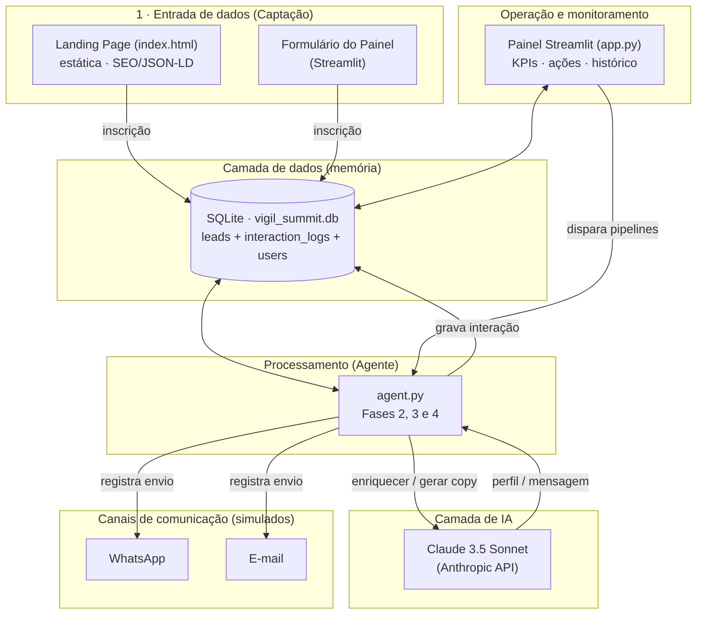

# Vigil Summit Agent — Agente Autônomo de Funil para Eventos B2B

> Case AI Engineer (Pareto) · Cliente: **Vigil.AI** · Evento: **Vigil Summit — Segurança para a Era da IA**

Agente de IA que gerencia o **funil completo de um evento corporativo B2B**, da captação do lead à reunião comercial agendada, atacando os três gargalos clássicos desse tipo de evento: **geração de leads qualificados**, **no-show** (40–60% dos inscritos) e **follow-up frio**.

A solução usa **Claude 3.5 Sonnet** para enriquecer perfis e gerar comunicação personalizada de alta conversão, **SQLite** como memória de contexto do funil, uma **landing page** de captação e um **painel Streamlit** para operação e monitoramento.

---

## Índice

1. [Visão geral e funil](#1-visão-geral-e-funil)
2. [Arquitetura da solução](#2-arquitetura-da-solução)
3. [Stack tecnológico justificado](#3-stack-tecnológico-justificado)
4. [Réguas de comunicação](#4-réguas-de-comunicação)
5. [Estratégia de dados, personalização e LGPD](#5-estratégia-de-dados-personalização-e-lgpd)
6. [Decisões estratégicas e racional](#6-decisões-estratégicas-e-racional)
7. [Plano de execução (primeiros 5 dias)](#7-plano-de-execução-primeiros-5-dias)
8. [Cenário de escala (pergunta bônus)](#8-cenário-de-escala-pergunta-bônus)
9. [Como instalar e rodar](#9-como-instalar-e-rodar)
10. [Como testar (acesso para a Pareto)](#10-como-testar-acesso-para-a-pareto)
11. [Modelo de dados](#11-modelo-de-dados)
12. [Limitações e decisões conscientes](#12-limitações-e-decisões-conscientes)

---

## 1. Visão geral e funil

O agente cobre as quatro fases do funil pedidas no case:

| Fase | Objetivo | Onde vive |
|------|----------|-----------|
| **1 · Captação** | Capturar o contato certo (decisores de segurança/TI) | `index.html` (LP) + formulário no painel (`app.py`) |
| **2 · Enriquecimento** | Inferir cargo real, setor, porte e dores antes de qualquer mensagem | `agent.py · run_enrichment_pipeline()` |
| **3 · Engajamento pré-evento** | Confirmar presença e reduzir no-show (meta > 70%) | `agent.py · run_pre_event_engagement()` / `run_pre_event_sequence()` |
| **4 · Follow-up pós-evento** | Converter presença em reunião comercial | `agent.py · run_post_event_sequence()` |

O **status do lead** caminha por quatro estágios, persistidos no banco:

```
Inscrito  →  Confirmado  →  Presente  →  Reunião Agendada
```

---

## 2. Arquitetura da solução

### 2.1 Camadas



### 2.2 Fluxo de dados (ponta a ponta)

1. **Captação:** o lead se inscreve pela LP ou pelo painel → cria registro em `leads` com `status_funil = 'Inscrito'` e `origem` (`LP_Organico` ou `Remarketing`).
2. **Enriquecimento:** o agente seleciona leads sem `cargo_real`/`tamanho_empresa`, envia (nome, cargo declarado, empresa) ao Claude e grava o perfil deduzido.
3. **Engajamento:** para cada `Inscrito` enriquecido, o agente gera uma mensagem personalizada de confirmação (gatilho de compromisso) e registra em `interaction_logs`. A resposta do lead (`receive_lead_response`) promove o status para `Confirmado`.
4. **Follow-up:** após o evento, presentes recebem a régua comercial; quem confirmou e não veio entra na régua de reengajamento de no-show.
5. **Monitoramento:** o painel lê o banco em tempo real, exibe KPIs do funil e permite operar todas as fases.

### 2.3 Onde cada fase do funil se encaixa

- **Captação** → camada de entrada (LP + painel) grava em `leads`.
- **Enriquecimento** → Agente + LLM, escreve de volta em `leads`.
- **Engajamento / Follow-up** → Agente + LLM, escreve em `interaction_logs` e atualiza `status_funil`.

---

## 3. Stack tecnológico justificado

| Camada | Escolha | Por quê |
|--------|---------|---------|
| **LLM** | **Claude 3.5 Sonnet** (`claude-3-5-sonnet-20241022`), com camada **multi-provedor** | Preferência explícita do case (ecossistema Anthropic). A camada de LLM é abstraída (`_chat`) e configurável via `LLM_PROVIDER` no `.env`, suportando também **Groq** (compatível com OpenAI) para desenvolvimento/teste sem custo. A lógica do agente independe do provedor. |
| **Orquestração do agente** | **SDK nativo (Anthropic / OpenAI-compat)** | Para um funil determinístico (etapas e gatilhos bem definidos), o SDK nativo dá **controle total e transparência** sobre cada prompt/resposta, sem a camada de abstração de um framework. `agno` está listado no `requirements` como caminho de evolução (tool-use/orquestração multiagente) quando a complexidade justificar. |
| **Banco de dados** | **SQLite** | Relacional, zero-config, arquivo único — ideal para um protótipo **demonstrável e inspecionável** pela banca. O modelo de dados é portável para Postgres sem reescrever a lógica. |
| **Captação (LP)** | **HTML/CSS/JS estático** | Hospedagem gratuita (GitHub Pages/Vercel/Netlify), carregamento rápido e **SEO para IA** via JSON-LD — relevante para indexação em buscas generativas (Perplexity, SearchGPT, Gemini). |
| **Interface/Operação** | **Streamlit** | Painel funcional em Python puro, sem front-end dedicado. Cobre o opcional "painel de monitoramento" e "interface protegida por senha" (login **multiusuário** com senhas em hash). |
| **Config/Segredos** | **python-dotenv** | Carrega `ANTHROPIC_API_KEY` e parâmetros (`VIGIL_EVENT_DATE`, `APP_PASSWORD`) do `.env`, mantido fora do versionamento. |
| **Dados/Tabelas** | **pandas** | Leitura e exibição tabular no painel. |

**Canal de comunicação:** combinação **WhatsApp + E-mail**. Justificativa pelo público (CISOs/CTOs/diretores): o **WhatsApp** tem altíssima taxa de abertura e é ideal para lembretes curtos e confirmação (reduz no-show); o **e-mail** carrega credibilidade executiva e conteúdo mais rico (agenda, recap, materiais). No protótipo o **envio é simulado** (o conteúdo é gerado e persistido em `interaction_logs`), com a arquitetura isolando geração de envio para plugar Twilio/Meta (WhatsApp) ou SMTP/SendGrid (e-mail) sem refatorar a lógica.

---

## 4. Réguas de comunicação

As duas réguas são **personalizadas pelo enriquecimento** (cargo real, setor, porte e dores) e **segmentadas pela origem** do lead (`Remarketing` vs `LP_Organico`).

### 4.1 Régua PRÉ-evento (confirmação · anti no-show)

**Regras de negócio (gatilhos, condições, timing):**

| Timing | Canal | Tipo | Regra de negócio |
|--------|-------|------|------------------|
| **D-14** | E-mail | `Boas_Vindas` | Ancoragem de valor: conecta as **dores do lead** às palestras/demos. |
| **D-7** | WhatsApp | `Pedido_Confirmacao` | **Gatilho de compromisso** + **regra de acompanhante** (convida a trazer o CTO/diretor de risco). |
| **D-3** | WhatsApp | `Gatilho_Escassez` | **Escassez por proximidade** (poucas vagas / lista de espera). Tom mais assertivo para **quem ainda não confirmou**. |
| **D-1** | WhatsApp | `Lembrete_Logistico` | Lembrete de véspera (horário, local) para cortar no-show de última hora. |

**Gatilho de compromisso (neurociência — *commitment & consistency*, Cialdini):** a mensagem de confirmação induz o lead a responder com a frase exata **"Eu irei ao evento"**. Quando essa resposta chega (`receive_lead_response`), o status vira `Confirmado`. A microdecisão pública de se comprometer aumenta a probabilidade de comparecimento.

**Segmentação:** leads de **Remarketing** (base de edições anteriores) abrem relembrando o relacionamento ("que bom te ver de volta"); leads **orgânicos da LP** são tratados como primeiro contato.

**Exemplo de mensagem personalizada** (lead: *Carlos Mendes — Gerente Comercial Sênior, Varejo Mais, Varejo, +1000 func.; segmento Remarketing; canal WhatsApp; D-7*):

> Olá Carlos, que bom te ver de novo por aqui! 👋 No Vigil Summit deste ano teremos uma demo ao vivo de como blindar dados de clientes no varejo e manter a LGPD em dia sem travar a operação — exatamente a dor que mais pesa no seu setor. Como são só 120 vagas (e você pode trazer um diretor da sua equipe), me responda com **"Eu irei ao evento"** para eu garantir o seu lugar.

### 4.2 Régua PÓS-evento (follow-up comercial)

| Timing | Canal | Tipo | Objetivo |
|--------|-------|------|----------|
| **D+1** | E-mail | `Agradecimento_Recap` | Recap personalizado do que ele viu + CTA suave (conversa de 30 min). |
| **D+3** | WhatsApp | `Convite_Reuniao` | Proposta concreta de reunião com **2 horários** + ROI ligado às dores. |
| **D+7** | E-mail | `Ultima_Chamada` | Última chamada para quem não respondeu + oferta de material de valor. |

**Régua paralela de no-show** (`Reengajamento_NoShow`): quem confirmou mas **não compareceu** recebe uma trilha separada — empatia ("sentimos sua falta") + gravação das palestras + oferta de demo 1:1.

**Exemplo de mensagem personalizada** (lead: *Mariana Lima — COO, TechCorp, SaaS B2B, 201-500 func.; status Presente; canal E-mail; D+1*):

> **Assunto:** Mariana, o próximo passo depois do Vigil Summit
>
> Mariana, foi ótimo ter você no Vigil Summit! Na demo de monitoramento contínuo, mostramos como antecipar incidentes antes que virem exposição — algo crítico para uma operação SaaS B2B em crescimento como a da TechCorp, onde conformidade (SOC 2/LGPD) abre portas comerciais. Faz sentido marcarmos 30 minutos para eu te mostrar isso aplicado ao seu ambiente? Tenho agenda esta semana.

---

## 5. Estratégia de dados, personalização e LGPD

### 5.1 Coleta e armazenamento
- **Coleta:** formulário da LP / painel (dados declarados: nome, e-mail corporativo, cargo, empresa, telefone).
- **Armazenamento:** SQLite (`vigil_summit.db`), tabela `leads` (perfil + status) e `interaction_logs` (cada mensagem enviada e a resposta do lead — a **memória de contexto** do agente).

### 5.2 Como o enriquecimento funciona na prática
- **Entrada:** nome, cargo declarado e empresa.
- **Processo:** o Claude atua como "agente de inteligência de mercado B2B" e **deduz** `cargo_real`, `setor`, `tamanho_empresa` e `sinais_interesse` (dores prováveis), retornando **JSON estrito** validado pelo código.
- **Uso:** os campos enriquecidos alimentam **todas** as mensagens das réguas — é o que torna o copy não-genérico.
- **Fonte (honestidade técnica):** no protótipo o enriquecimento é uma **dedução do LLM** com base em padrões de mercado, **não** uma consulta a fontes externas. Em produção, plugaríamos enriquecimento real (LinkedIn/Apollo/Clearbit/Receita) **antes** da camada do LLM, mantendo a mesma interface.

### 5.3 Conformidade com a LGPD
- **Base legal:** o titular fornece os dados ativamente ao se inscrever, com finalidade explícita (participação no evento e contato comercial) — consentimento + legítimo interesse.
- **Transparência:** a LP informa, no formulário, que os dados são tratados conforme a LGPD.
- **Minimização:** coletamos apenas o necessário para operar o funil.
- **Segredos e dados:** `.env` e o banco local ficam **fora do versionamento** (`.gitignore`).
- **Direitos do titular:** o modelo permite exclusão/atualização por registro (chave `id`/`email`), suportando solicitações de eliminação.
- **Coerência da automação:** enriquecimento é **dedução**, não decisão automatizada com efeito jurídico sobre o titular.

---

## 6. Decisões estratégicas e racional

### Três principais decisões

1. **Campo `origem` explícito em vez de proxy por domínio de e-mail.**
   - *Racional:* remarketing se define pela **fonte** do lead, não pelo domínio corporativo. Segmentar por e-mail mandaria "que bom te ver de volta" para quem nunca teve contato — queimando lead.
   - *Alternativa descartada:* `email.endswith("@dominio")` — frágil, acoplado e não-escalável.
   - *Ganho:* personalização correta hoje e base pronta para o cenário de 10 eventos.

2. **SDK nativo da Anthropic em vez de framework de agente.**
   - *Racional:* o funil é uma máquina de estados com etapas determinísticas; controle e transparência dos prompts valem mais que abstração.
   - *Alternativas consideradas:* LangChain/CrewAI/Agno — descartadas para o MVP por adicionarem complexidade sem ganho proporcional. `agno` fica como rota de evolução para tool-use.

3. **Envio simulado + persistência em `interaction_logs`, com canais desacoplados.**
   - *Racional:* o case **aceita interações simuladas**; o que importa é o fluxo demonstrável e a memória. Isolar "gerar" de "enviar" permite plugar WhatsApp/e-mail reais depois sem tocar na lógica.
   - *Alternativa descartada:* integrar Twilio/Meta já no MVP — alto custo de setup e baixo retorno para a avaliação.

### Referências de mercado / frameworks
- **Cialdini** (gatilhos de *commitment & consistency*, escassez e prova social) nas réguas.
- **Boas práticas de réguas anti no-show** de eventos B2B (sequência multi-toque por proximidade da data).
- **Modelo AAARRR / funil de eventos** para a divisão captação → confirmação → presença → reunião.

---

## 7. Plano de execução (primeiros 5 dias)

> Premissa: começo amanhã, com o protótipo atual já em mãos.

- **Dia 1 — Fundação e captação real.** Provisionar ambiente (chaves Anthropic, deploy da LP em Vercel/Netlify) e **conectar a LP ao banco** via endpoint serverless (`POST` → `insert_lead`). Atacar a **Captação** primeiro, pois sem leads reais nada flui.
- **Dia 2 — Enriquecimento robusto.** Plugar uma fonte real de enriquecimento (LinkedIn/Apollo) antes do LLM e tratar rate limits/erros; logar custo por lead.
- **Dia 3 — Réguas e agendador.** Migrar de execução manual para **scheduler** (cron/APScheduler) disparando as etapas por proximidade da data; integrar canal real (WhatsApp via provedor).
- **Dia 4 — Loop de resposta.** Substituir o match por frase exata por **classificação de intenção** (Claude) das respostas reais; webhooks de entrada e atualização de status.
- **Dia 5 — Observabilidade e hardening.** Métricas do funil, alertas, testes e endurecimento de LGPD (política de retenção, opt-out). Migração SQLite → Postgres se o volume exigir.

---

## 8. Cenário de escala (pergunta bônus)

> *"Replicar para 10 eventos regionais simultâneos, com públicos distintos (manufatura, saúde, financeiro, governo), sem reescrever o agente."*

A arquitetura já aponta para isso. As mudanças necessárias:

1. **Multi-tenant por `evento_id`.** Adicionar `evento_id` a `leads` e `interaction_logs`; todo o pipeline filtra por evento. Um único agente serve N eventos.
2. **Configuração por evento (data-driven, não código).** Cada evento tem um arquivo/registro de config: data, vagas, **persona do público** (manufatura, saúde…), tom e contexto de negócio. As réguas e prompts já recebem esse contexto por parâmetro — basta trocar a config, **não o código**.
3. **Enriquecimento e copy sensíveis ao vertical.** O `setor`/persona do evento entra no system prompt; o Claude adapta dores e exemplos (ex.: HIPAA-equivalente/dados de paciente para saúde; OT/ICS para manufatura; Bacen/PCI para financeiro; soberania de dados para governo).
4. **`origem` por evento.** O campo já distingue remarketing × orgânico — por evento, viabiliza réguas e públicos diferentes sem ambiguidade.
5. **Orquestração e fila.** Scheduler central + fila de mensagens (ex.: Celery/RQ) para paralelizar os 10 funis; banco em Postgres.

**Resumo:** o que muda entre eventos é **dado/configuração** (persona, datas, contexto), não a lógica do agente — exatamente o que evita reescrever do zero.

---

## 9. Como instalar e rodar

> **Ambiente Windows/PowerShell:** use o launcher **`py`** (o comando `python` pode não estar disponível). Para scripts com emojis no console, use **`py -X utf8`**.

```powershell
# 1. Dependências
cd vigil_summit_agent
py -m pip install -r requirements.txt

# 2. Configurar o ambiente: copie o .env.example para .env
#    copy .env.example .env   (Windows)   |   cp .env.example .env (Linux/Mac)
#    Ja vem pronto com LLM_PROVIDER=groq e uma chave Groq de teste (free tier).
#    Para usar o Claude: LLM_PROVIDER=anthropic + ANTHROPIC_API_KEY=...
#    (opcional) VIGIL_EVENT_DATE=2026-06-30
#    (opcional) APP_PASSWORD=uma_senha   -> protege o painel (padrao: vigil2026)

# 3. Criar e popular o banco
py -X utf8 database.py

# 4a. Rodar o agente via CLI
py -X utf8 agent.py enrich   # Fase 2 - enriquecimento
py -X utf8 agent.py engage   # Fase 3 - confirmação (neurociência) + respostas simuladas
py -X utf8 agent.py pre      # Fase 3 - régua pré-evento completa (4 toques)
py -X utf8 agent.py post     # Fase 4 - régua pós-evento
py -X utf8 agent.py demo     # funil completo de ponta a ponta

# 4b. Rodar LP + API + painel com um comando (recomendado)
py run_dev.py
#    LP  → http://localhost:8080
#    App → http://localhost:8501

# Ou, em dois terminais separados:
# py -m uvicorn api:app --reload --port 8080   → http://localhost:8080
# py -m streamlit run app.py                   → http://localhost:8501
```

A **landing page** (`index.html`) é servida pelo **`api.py`** (FastAPI) em `http://localhost:8080`. O formulário grava leads reais no SQLite; o painel Streamlit lê o mesmo banco.

**Deploy simples (produção):**

| Componente | Onde | URL |
|------------|------|-----|
| **Landing Page** | GitHub Pages | https://irgomallis.github.io/vigil_summit_agent/ |
| **API de captação** | Render (blueprint `render.yaml`) | https://vigil-summit-api.onrender.com |
| **Painel Streamlit** | Streamlit Community Cloud | https://share.streamlit.io → ver passo 3 abaixo |

1. **GitHub Pages** — ativado via GitHub Actions (workflow `.github/workflows/pages.yml`). A LP envia inscrições para a API no Render.
2. **Render** — clique em [Deploy to Render](https://render.com/deploy?repo=https://github.com/IrgoMallis/vigil_summit_agent) ou conecte o repo em [dashboard.render.com](https://dashboard.render.com). Configure `GROQ_API_KEY` nos Environment Variables. Sem a API no ar, o formulário da LP online não grava leads.
3. **Streamlit Cloud** — acesse [share.streamlit.io](https://share.streamlit.io) → **Create app** → repo `IrgoMallis/vigil_summit_agent`, branch `main`, **Main file path:** `vigil_summit_agent/app.py`. Em **Advanced settings**, working directory: `vigil_summit_agent`. Em **Secrets**, cole as variáveis do `.env.example` (com chaves reais).

> **Nota:** localmente LP + painel compartilham o mesmo SQLite. Na nuvem, a API (Render) e o painel (Streamlit Cloud) usam instâncias separadas — inscrições pela LP ficam na API até integrar um banco compartilhado (Postgres), previsto no plano de escala do README.

---

## 10. Como testar (acesso para a Pareto)

> **Adendo sobre o LLM usado nos testes.** Todo o projeto foi desenvolvido e testado usando o **Groq** (`llama-3.3-70b-versatile`) como provedor de LLM, aproveitando o **free tier** para validar o funil ponta a ponta sem custo. Para que a avaliação rode de imediato, **já deixei uma chave Groq de teste** no `.env.example` (`LLM_PROVIDER=groq`) — basta copiá-lo para `.env` e tudo funciona.
>
> Fiquem à vontade para integrar a **Anthropic (Claude 3.5 Sonnet)**, que considero a **melhor opção** para a qualidade do copy e do enriquecimento — a camada de LLM é abstraída (`_chat`), então é só trocar `LLM_PROVIDER=anthropic` e informar a `ANTHROPIC_API_KEY`. Optei pelo Groq na fase de desenvolvimento por uma questão de custo durante os testes. 😄

- **Acesso ao painel (login):** o painel é protegido por **login de usuário + senha**. Na primeira execução, um usuário inicial é criado automaticamente:
  - **Usuário:** `admin` · **Senha:** `vigil2026` (ou o valor de `APP_PASSWORD`, se definido).
  - Na aba **"👤 Usuários"** é possível **criar e remover** outros usuários da equipe. As senhas são guardadas apenas como **hash PBKDF2-HMAC-SHA256 com salt** (nunca em texto puro). Há travas de segurança: não é possível remover o próprio usuário conectado nem deixar o painel sem nenhum acesso.
- O banco já vem com **3 leads sintéticos** (seed), incluindo **`ramon@pareto.io`** com status `Inscrito`, conforme solicitado no case.
- **Fluxo recomendado de teste:**
  1. `py -X utf8 database.py` (cria o banco).
  2. `py -m streamlit run app.py`, faça login (`admin` / `vigil2026`) e explore as abas.
  3. Em **"🤖 Operar o agente"**, clique em **"Fase 2 · Enriquecer"** → veja os perfis preenchidos.
  4. Clique em **"Fase 3 · Engajar + respostas"** → veja as mensagens geradas e leads virando `Confirmado`.
  5. Use **"🎬 Demo ponta a ponta"** para rodar todo o funil de uma vez.
  6. Na aba **"👥 Leads" → Detalhe do lead**, inspecione o histórico de interações e simule respostas.
- O painel é organizado em abas: **Visão geral** (KPIs e funil de conversão), **Leads** (tabela e detalhe), **Operar o agente** (Fases 2–4), **Interações** (log completo) e **Usuários** (controle de acesso).
- As ações de IA exigem a chave do provedor ativo no `.env` (`ANTHROPIC_API_KEY` ou `GROQ_API_KEY`, conforme `LLM_PROVIDER`). Sem ela, o painel exibe o funil normalmente, mas as ações de geração ficam desabilitadas.

---

## 11. Modelo de dados

### Tabela `leads`
| Campo | Tipo | Notas |
|-------|------|-------|
| `id` | INTEGER PK | autoincremento |
| `nome` | TEXT NOT NULL | |
| `email` | TEXT UNIQUE NOT NULL | |
| `telefone` | TEXT | |
| `cargo_declarado` | TEXT | informado na captação |
| `empresa` | TEXT | |
| `cargo_real` | TEXT | **enriquecido** |
| `setor` | TEXT | **enriquecido** |
| `tamanho_empresa` | TEXT | **enriquecido** |
| `linkedin_perfil` | TEXT | |
| `sinais_interesse` | TEXT | **enriquecido** (dores) |
| `origem` | TEXT | `LP_Organico` \| `Remarketing` (default `Remarketing`) |
| `status_funil` | TEXT | `Inscrito`/`Confirmado`/`Presente`/`Reunião Agendada` (default `Inscrito`) |
| `data_inscricao` | DATETIME | default `CURRENT_TIMESTAMP` |
| `updated_at` | DATETIME | atualizado por trigger em cada UPDATE |

### Tabela `interaction_logs`
| Campo | Tipo | Notas |
|-------|------|-------|
| `id` | INTEGER PK | autoincremento |
| `lead_id` | INTEGER | FK → `leads(id)` |
| `fase_funil` | TEXT | ex.: `Pre-Evento`, `Pos-Evento` |
| `canal` | TEXT | `WhatsApp`, `E-mail` |
| `tipo_mensagem` | TEXT | ex.: `Confirmacao_Neurociencia`, `Convite_Reuniao` |
| `conteudo_enviado` | TEXT | mensagem gerada pelo LLM |
| `resposta_lead` | TEXT | resposta simulada do lead |
| `data_envio` | DATETIME | default `CURRENT_TIMESTAMP` |

### Tabela `users`
| Campo | Tipo | Notas |
|-------|------|-------|
| `id` | INTEGER PK | autoincremento |
| `username` | TEXT UNIQUE NOT NULL | usuário de acesso ao painel |
| `password_salt` | TEXT NOT NULL | salt aleatório por usuário |
| `password_hash` | TEXT NOT NULL | hash PBKDF2-HMAC-SHA256 (200k iterações) |
| `created_at` | DATETIME | default `CURRENT_TIMESTAMP` |

---

## 12. Limitações e decisões conscientes

- **Captação da LP é real** via `POST /api/inscricao` (`api.py` → `insert_lead`, origem `LP_Organico`). LP e painel compartilham o mesmo SQLite localmente.
- **Envio de mensagens é simulado** (persistido em `interaction_logs`), com canais desacoplados para integração futura.
- **Enriquecimento é dedução do LLM**, não consulta a fontes externas (substituível sem mudar a interface).
- **Confirmação por frase exata** ("Eu irei ao evento") é adequada ao protótipo; em produção, dá lugar a classificação de intenção via Claude.
- **SQLite** atende o protótipo; o modelo é portável para Postgres no cenário de escala.

---

## Estrutura do projeto

```
Case - AI Engineer (2026)/
├── index.html                 # Landing page de captação (Fase 1)
├── README.md                  # Este documento
├── .gitignore
└── vigil_summit_agent/
    ├── .env                   # segredos (fora do versionamento)
    ├── .env.example
    ├── database.py            # schema, seed e acesso ao SQLite
    ├── agent.py               # cérebro do agente (Fases 2, 3 e 4)
    ├── api.py                 # LP + API de captação (FastAPI)
    ├── app.py                 # painel Streamlit (operação e monitoramento)
    ├── requirements.txt
    └── vigil_summit.db        # banco (gerado ao rodar database.py)
```
